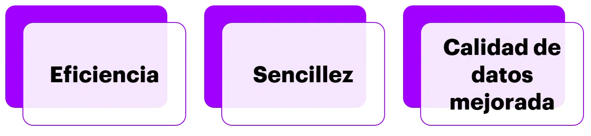
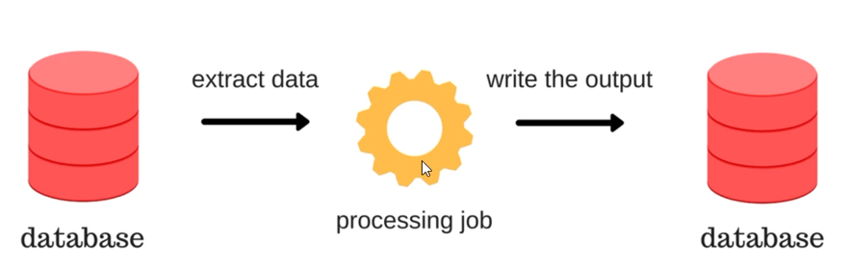
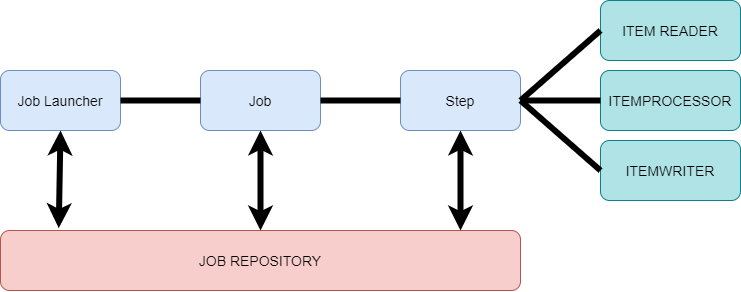
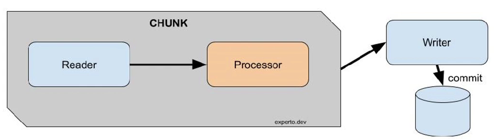

# Introducción a Batch Processing

## ¿Que es el BATCH PROCESSING?
En terminos  simples, es un metodo para procesar consistenmente grandes cantidades de datos.
Cuando hay suficientes recursos informáticos disponibles, el método por lotes le permite procesar datos con poca o ninguna interacción del usuario.

## ¿Cuales son las características clave del Batch Processing?
* ***Eficacia*** : se programan procesos que no son tan urgentes 
* ***Sencillez*** : este no requiere un sistema complejo, no requiere mantenimiento
* ***Calidad de datos mejorada*** : Al tener pocesos automizados, tenemos interaccion con ususario, podemos mejorar la calidad de nuestro codigo en errores humanos, error del sistema, etc.

Se ve claro que el batch procesing realizara un extracion de datos de nuestra base de datos, despues va procesando la informacion y por ultimo lo va almacenar en otra base de datos.

## ¿Cuándo se debe utilizar el Batch Processing?

Las cosas que no necesitan procesamiento en tiempo real y son candidatos ideales para el procesamiento por lotes podrían incluir:

- Procesamiento de nóminas y partes de horas.
- Facturas de partida para cualquier empresa u organizacion que acumule datos y produzca un resultado principal en un momento determinado
- Estados de cuenta
- Investigacion y presentación de informes
- Sistemas de factuiracion que pueden preferir factuar una vez a la semana o al mes
- Administracion de actualizaciones de base de datos
- Archivos que se convierten de un archivo a otro, por ejemplo, facturas de fin de mes que cambien de un formato a PDF

## Las alternativas al Batch Processing

El stream processing trata de no tener una gran cantidad de volumenes a comparacion de Batch Processing, requiriendo hacerlo en pequeñas cantidades y en un corto tiempo.

El REAL-TIME OPERATING SYSTEMS que es mas conocido con sistema en tiempo real, significa que la aplicacion se realiza en cuestion ya sea de milisegundo o segundos, y como ejemplo para poder entender este concepto seria como la bolsa de valores donde se ve en ese momento como cambian los numeros.

---
Antes de querer entender que es Spring Batch se debe conocer que es Spring Boot? 
* Que es SPRING FRAMEWORK? Es una framework Open Source que facilita la creacion de aplicaciones de todo tipo de Java, Kotlin y Groovy. Tambien es conocido por que utiliza la inyeccion de independencias y de patrones de diseño y el test.

Si bien es cierto que Spring Frameworj es muy potente, la configuracion inicial y la preparacion de las aplicaciones para produccion son tareas bastante tediosas. Spring Boot simplifica el porceso al maximo gracias a sus dos principales mecanismos:

### Contenedor de aplicaciones integrado

- Spring Boot permite compilar nuestras aplicaciones Web como un archivo .jar que podemos ejecutar como una aplicacion Java normal.

- Este consigue integrado el servidor de aplicaciones en el propio .jar y levantandolo cuando arranquemos la aplicacion.

### Staters

- Spring Boot nos proporciona una serie de dependencias, llamadas staters, que podemos añadir a nuestro proyecto dependiendo de lo que necesite.
- Una vez añadimos un starter, este nos proporciona todas las dependencias que necesitamos, tanto de Spring como de terceros

---

# SPRING BATCH
### ¿Que es?
Es un  framework ligero open source para procesamientos batch o procesamientos por lotes. Este framework es un modulo de Spring y fue desarrollado como fruto de una colaboracion entre SrpingSource (ahora Pivotal) y **Accenture**

### Cuales son los compoenetes principales de Spring Batch

- **Job Launcher** Es el componente encargado de la persistencia de metadatos

- **Job** Es la presentacion del proceso, un proceso, a su vez, es un contenedor de pasos (steps).
- **Step** Un step (paso) es un elemento independiente dentro de un job (un proceso) que representa una de las fases de las que esta compuesto dicho proceso. Un proceso (Job) debe tener, al menos, un step.
- **ItemReader** Elemento responsables de leer datos de una fuente de datos (BBDD, Fichero, cola de mensajes, etc...).

- **ItenProcessor** Elemento responsable tratar la informacion obtenida por el reader. No es obligatorio su uso
- **ItemWriter** Elemento responsable de guardar la informacion leida por reader o trata por el processor. Si hay un reader debe haber un writer. 

# CHUNK-ORIENTED PROCESSING
Chunk-Oriented es la tecnica que utiliza Spring Batch para ala ejecucion de las fases de un proceso (notese que es posible no utilizar en todos los steps este enfoque)

### Funcionando de la siguinete manera...

El reader (en el punto anterior vimos que un step posia contener un reader, un writer y un processor) lee una procion de datos de la fuente de datos y los convierte en un <<chunck>> (entidad que representa esa porcion de infromacion leída). Si existe un processor, ese chunk pasa al processor para que lo trate. Todo esto se realiza dentro de un limite transaccional o, lo que es lo mismo, leemos y tratamos tantos chunks como queramos antes de que sean persistidos por writer.

