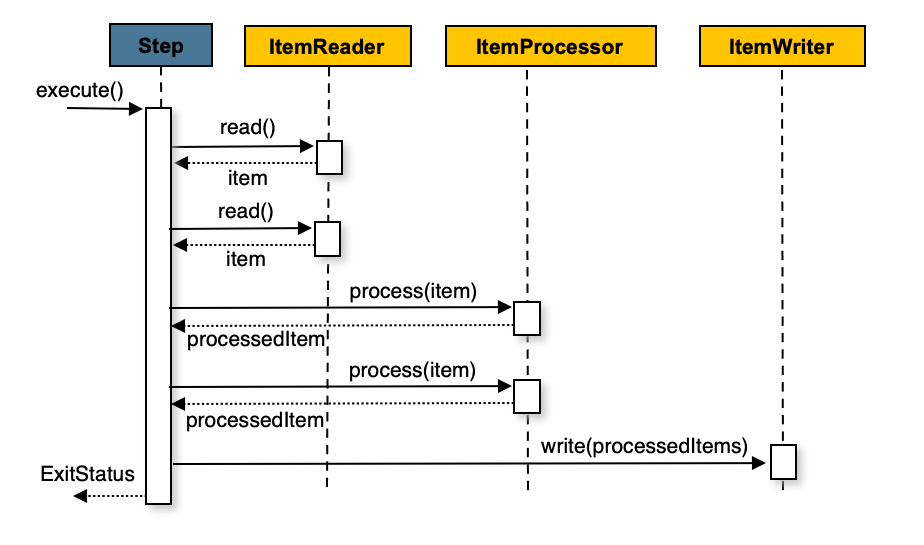

# Introducción a Batch Processing

## ¿Que es el BATCH PROCESSING?
En terminos  simples, es un metodo para procesar consistenmente grandes cantidades de datos.
Cuando hay suficientes recursos informáticos disponibles, el método por lotes le permite procesar datos con poca o ninguna interacción del usuario.

## ¿Cuales son las características clave del Batch Processing?
* ***Eficacia*** : se programan procesos que no son tan urgentes 
* ***Sencillez*** : este no requiere un sistema complejo, no requiere mantenimiento
* ***Calidad de datos mejorada*** : Al tener pocesos automizados, tenemos interaccion con ususario, podemos mejorar la calidad de nuestro codigo en errores humanos, error del sistema, etc.


Se ve claro que el batch procesing realizara un extracion de datos de nuestra base de datos, despues va procesando la informacion y por ultimo lo va almacenar en otra base de datos.


## ¿Cuándo se debe utilizar el Batch Processing?

Las cosas que no necesitan procesamiento en tiempo real y son candidatos ideales para el procesamiento por lotes podrían incluir:

- Procesamiento de nóminas y partes de horas.
- Facturas de partida para cualquier empresa u organizacion que acumule datos y produzca un resultado principal en un momento determinado
- Estados de cuenta
- Investigacion y presentación de informes
- Sistemas de factuiracion que pueden preferir factuar una vez a la semana o al mes
- Administracion de actualizaciones de base de datos
- Archivos que se convierten de un archivo a otro, por ejemplo, facturas de fin de mes que cambien de un formato a PDF

## Las alternativas al Batch Processing


El stream processing trata de no tener una gran cantidad de volumenes a comparacion de Batch Processing, requiriendo hacerlo en pequeñas cantidades y en un corto tiempo.


El REAL-TIME OPERATING SYSTEMS que es mas conocido con sistema en tiempo real, significa que la aplicacion se realiza en cuestion ya sea de milisegundo o segundos, y como ejemplo para poder entender este concepto seria como la bolsa de valores donde se ve en ese momento como cambian los numeros.

---
Antes de querer entender que es Spring Batch se debe conocer que es Spring Boot? 
* Que es SPRING FRAMEWORK? Es una framework Open Source que facilita la creacion de aplicaciones de todo tipo de Java, Kotlin y Groovy. Tambien es conocido por que utiliza la inyeccion de independencias y de patrones de diseño y el test.

Si bien es cierto que Spring Frameworj es muy potente, la configuracion inicial y la preparacion de las aplicaciones para produccion son tareas bastante tediosas. Spring Boot simplifica el porceso al maximo gracias a sus dos principales mecanismos:

### Contenedor de aplicaciones integrado

- Spring Boot permite compilar nuestras aplicaciones Web como un archivo .jar que podemos ejecutar como una aplicacion Java normal.

- Este consigue integrado el servidor de aplicaciones en el propio .jar y levantandolo cuando arranquemos la aplicacion.

### Staters

- Spring Boot nos proporciona una serie de dependencias, llamadas staters, que podemos añadir a nuestro proyecto dependiendo de lo que necesite.
- Una vez añadimos un starter, este nos proporciona todas las dependencias que necesitamos, tanto de Spring como de terceros

---

# SPRING BATCH
### ¿Que es?
Es un  framework ligero open source para procesamientos batch o procesamientos por lotes. Este framework es un modulo de Spring y fue desarrollado como fruto de una colaboracion entre SrpingSource (ahora Pivotal) y **Accenture**

### Cuales son los compoenetes principales de Spring Batch

- **Job Launcher** Es el componente encargado de la persistencia de metadatos

- **Job** Es la presentacion del proceso, un proceso, a su vez, es un contenedor de pasos (steps).
- **Step** Un step (paso) es un elemento independiente dentro de un job (un proceso) que representa una de las fases de las que esta compuesto dicho proceso. Un proceso (Job) debe tener, al menos, un step.
- **ItemReader** Elemento responsables de leer datos de una fuente de datos (BBDD, Fichero, cola de mensajes, etc...).

- **ItenProcessor** Elemento responsable tratar la informacion obtenida por el reader. No es obligatorio su uso
- **ItemWriter** Elemento responsable de guardar la informacion leida por reader o trata por el processor. Si hay un reader debe haber un writer. 


## CHUNK-ORIENTED PROCESSING
Chunk-Oriented es la tecnica que utiliza Spring Batch para ala ejecucion de las fases de un proceso (notese que es posible no utilizar en todos los steps este enfoque)


### Funcionando de la siguinete manera...

El reader (en el punto anterior vimos que un step posia contener un reader, un writer y un processor) lee una procion de datos de la fuente de datos y los convierte en un <<chunck>> (entidad que representa esa porcion de infromacion leída).
Si existe un processor, ese chunk pasa al processor para que lo trate. Todo esto se realiza dentro de un limite transaccional o, lo que es lo mismo, leemos y tratamos tantos chunks como queramos antes de que sean persistidos por writer.




## Proceso de instalacion para utilizar Spring Batch

Para poder utilizar Spring batach se requiere instalar los siguinetes programas dejando los links y leer la documentacion indicada

- [Java](https://www.oracle.com/java/technologies/downloads/)
- [Git](https://git-scm.com/)
- [Intelli Idea](https://www.jetbrains.com/idea/)
- [SDK](https://sdkman.io/install) 
- [Gradle](https://gradle.org/)

para lo que es **sdk** en caso de poder instalarlo hay que realizar los siguinete pasos que indica que tienes que hacer en caso de poder instalarlo [StackoverflowSDK](https://stackoverflow.com/questions/38782928/how-to-add-man-and-zip-to-git-bash-installation-on-windows) 

## Iniciando con el proyecto

Descargar el proyecto  atraves del siguienete repositorio d ela documentacion [SpringBatch](https://github.com/spring-guides/gs-batch-processing) o en su defecto clonar dicho repositorio y utilizarlo para fines de aprendizaje

```git
git@github.com:spring-guides/gs-batch-processing.git
```
### Analizando el proyecto
 Primero nos vamos al archivo donde se encontrara atraves en la siguiente ubiocacion del archivo **complete\src\main\java\com\example\batchprocessing\person.java** y se ecncontrara la siguinete informacion, donde en un clase con sus atirbutos, get and setters

```Java
package com.example.batchprocessing;

public class Person {

	private String lastName;
	private String firstName;

	public Person() {
	}

	public Person(String firstName, String lastName) {
		this.firstName = firstName;
		this.lastName = lastName;
	}

	public void setFirstName(String firstName) {
		this.firstName = firstName;
	}

	public String getFirstName() {
		return firstName;
	}

	public String getLastName() {
		return lastName;
	}

	public void setLastName(String lastName) {
		this.lastName = lastName;
	}

	@Override
	public String toString() {
		return "firstName: " + firstName + ", lastName: " + lastName;
	}

}

```

despues se encontrara el archivo **PersonItemProcessor.java** que este es el que realiza nuestro porcesador intermedio, que instancia los datos los canaliza y los pasa a otro sitio
```java
package com.example.batchprocessing;

import org.slf4j.Logger;
import org.slf4j.LoggerFactory;

import org.springframework.batch.item.ItemProcessor;

public class PersonItemProcessor implements ItemProcessor<Person, Person> {//clase que impelenta person person

	private static final Logger log = LoggerFactory.getLogger(PersonItemProcessor.class);

	@Override
	public Person process(final Person person) throws Exception {
		final String firstName = person.getFirstName().toUpperCase(); // transoforma los datos en mayusculas
		final String lastName = person.getLastName().toUpperCase();

		final Person transformedPerson = new Person(firstName, lastName);// aqui le pasa los datos y ya estan convertidas 

		log.info("Converting (" + person + ") into (" + transformedPerson + ")"); // loq ue realiza en la consola la persona se muestra en consola minuscula y mayuscula

		return transformedPerson;
	}

}

```
tambien esta el otro archivo de **batchConfiogurtation** que es el que trae todas la confoguracion de los batch oara poder utilizarlo correctamente

```java
package com.example.batchprocessing;

import javax.sql.DataSource;

import org.springframework.batch.core.Job;
import org.springframework.batch.core.JobExecutionListener;
import org.springframework.batch.core.Step;
import org.springframework.batch.core.configuration.annotation.EnableBatchProcessing;
import org.springframework.batch.core.configuration.annotation.JobBuilderFactory;
import org.springframework.batch.core.configuration.annotation.StepBuilderFactory;
import org.springframework.batch.core.launch.support.RunIdIncrementer;
import org.springframework.batch.item.database.BeanPropertyItemSqlParameterSourceProvider;
import org.springframework.batch.item.database.JdbcBatchItemWriter;
import org.springframework.batch.item.database.builder.JdbcBatchItemWriterBuilder;
import org.springframework.batch.item.file.FlatFileItemReader;
import org.springframework.batch.item.file.builder.FlatFileItemReaderBuilder;
import org.springframework.batch.item.file.mapping.BeanWrapperFieldSetMapper;
import org.springframework.batch.item.file.mapping.DefaultLineMapper;
import org.springframework.batch.item.file.transform.DelimitedLineTokenizer;
import org.springframework.beans.factory.annotation.Autowired;
import org.springframework.context.annotation.Bean;
import org.springframework.context.annotation.Configuration;
import org.springframework.core.io.ClassPathResource;
import org.springframework.jdbc.core.JdbcTemplate;

// tag::setup[]
@Configuration
@EnableBatchProcessing// incluye las instrucciones de SQL para la base de datos 
public class BatchConfiguration {

	@Autowired
	public JobBuilderFactory jobBuilderFactory;

	@Autowired
	public StepBuilderFactory stepBuilderFactory;
	// end::setup[]

	// tag::readerwriterprocessor[] // defien la entrada del procesador uy salida
	@Bean
	public FlatFileItemReader<Person> reader() {// realiza la lectura del archivo, mapea los campos 
		return new FlatFileItemReaderBuilder<Person>()
			.name("personItemReader")
			.resource(new ClassPathResource("sample-data.csv"))
			.delimited()
			.names(new String[]{"firstName", "lastName"})
			.fieldSetMapper(new BeanWrapperFieldSetMapper<Person>() {{
				setTargetType(Person.class);
			}})
			.build();
	}

	@Bean
	public PersonItemProcessor processor() { // crea una isntacia delproceso y tambiend e data
		return new PersonItemProcessor();
	}

	@Bean
	public JdbcBatchItemWriter<Person> writer(DataSource dataSource) { 
		return new JdbcBatchItemWriterBuilder<Person>()
			.itemSqlParameterSourceProvider(new BeanPropertyItemSqlParameterSourceProvider<>())
			.sql("INSERT INTO people (first_name, last_name) VALUES (:firstName, :lastName)") // realiza un inserte donde inyecta los datos
			.dataSource(dataSource)
			.build();
	}
	// end::readerwriterprocessor[]

	// tag::jobstep[]
	@Bean
	public Job importUserJob(JobCompletionNotificationListener listener, Step step1) {
		return jobBuilderFactory.get("importUserJob")
			.incrementer(new RunIdIncrementer())
			.listener(listener)
			.flow(step1)
			.end()
			.build();
	}

	@Bean
	public Step step1(JdbcBatchItemWriter<Person> writer) {// le pasamos el chunk de 10 que procesa los datos en lote de 10 en 10
		return stepBuilderFactory.get("step1")
			.<Person, Person> chunk(10)
			.reader(reader())
			.processor(processor())
			.writer(writer)
			.build();
	}
	// end::jobstep[]
}

```

```java
package com.example.batchprocessing;

import org.slf4j.Logger;
import org.slf4j.LoggerFactory;
import org.springframework.batch.core.BatchStatus;
import org.springframework.batch.core.JobExecution;
import org.springframework.batch.core.listener.JobExecutionListenerSupport;
import org.springframework.beans.factory.annotation.Autowired;
import org.springframework.jdbc.core.JdbcTemplate;
import org.springframework.stereotype.Component;

@Component
public class JobCompletionNotificationListener extends JobExecutionListenerSupport {

	private static final Logger log = LoggerFactory.getLogger(JobCompletionNotificationListener.class);

	private final JdbcTemplate jdbcTemplate;

	@Autowired
	public JobCompletionNotificationListener(JdbcTemplate jdbcTemplate) {
		this.jdbcTemplate = jdbcTemplate;
	}

	@Override
	public void afterJob(JobExecution jobExecution) {
		if(jobExecution.getStatus() == BatchStatus.COMPLETED) {// realiza un if supervisar si se completo la informacion
			log.info("!!! JOB FINISHED! Time to verify the results");

			jdbcTemplate.query("SELECT first_name, last_name FROM people",
				(rs, row) -> new Person(
					rs.getString(1), // pasa las filas y columnas 
					rs.getString(2))
			).forEach(person -> log.info("Found <" + person + "> in the database."));// ylos porcesa en nuestra consola a travez del foreach
		}
	}
}

```

```java
package com.example.batchprocessing;

import org.springframework.boot.SpringApplication;
import org.springframework.boot.autoconfigure.SpringBootApplication;

@SpringBootApplication // es una aspecto de convenienza que agrega diferentes decoradores, el autoconfiguration y agrega los bins de nuestra aplicacion
public class BatchProcessingApplication {

	public static void main(String[] args) throws Exception {
		System.exit(SpringApplication.exit(SpringApplication.run(BatchProcessingApplication.class, args)));
	}// es cuando se termina y se ejuta agrega los scaner componets y que realice una busqueda, indicandi que la aplicacion se ha ejecutado, para maven y gradle se debe tener la variable de entorno, realizando por lineas de comandos 
}
```